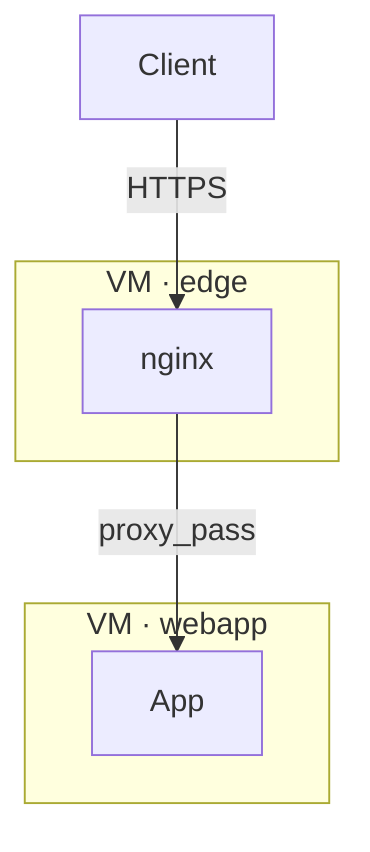
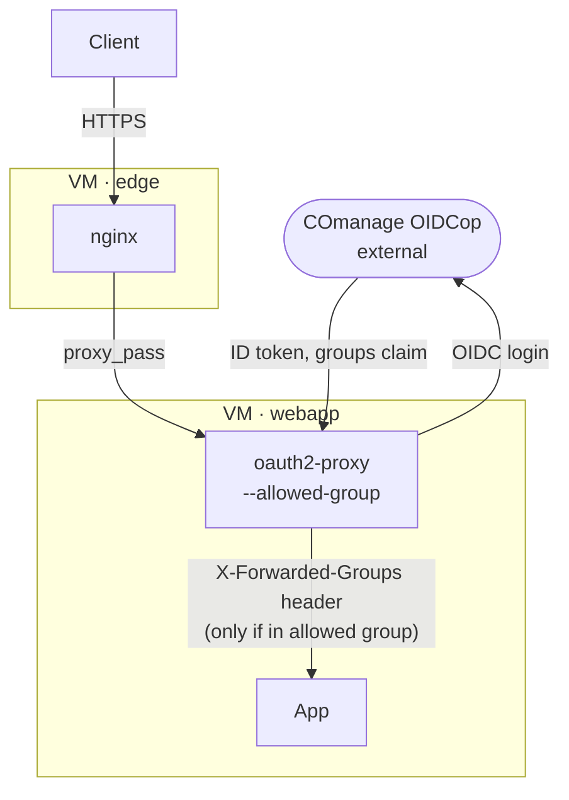
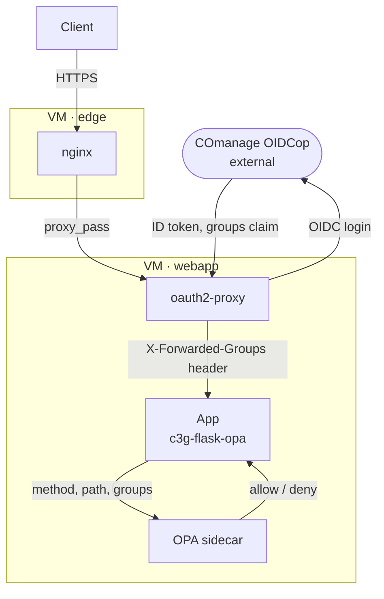
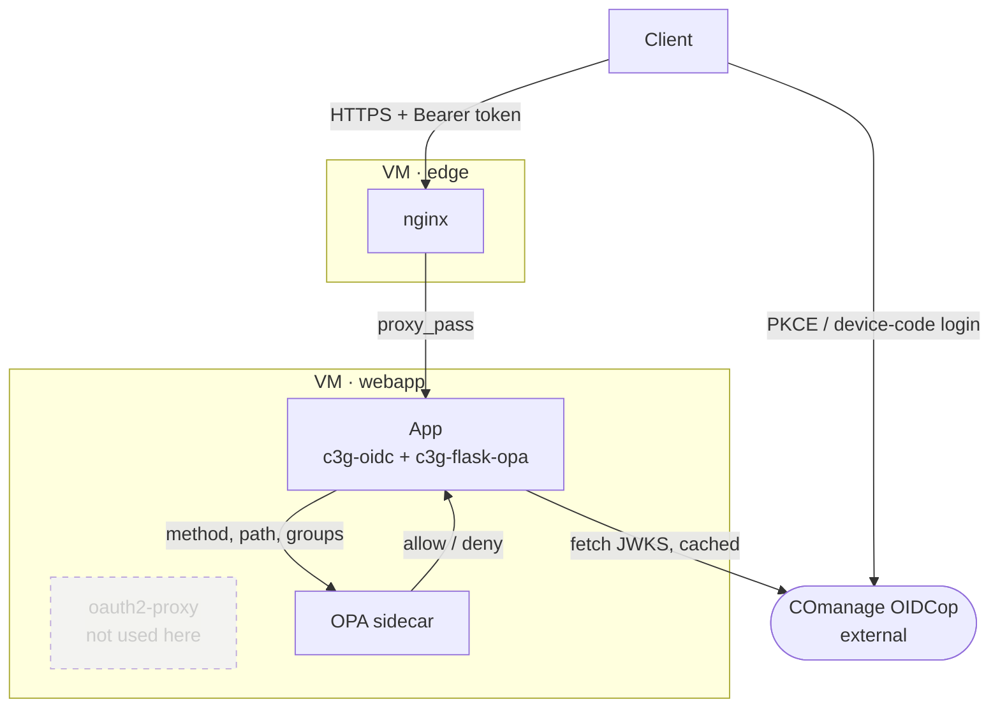
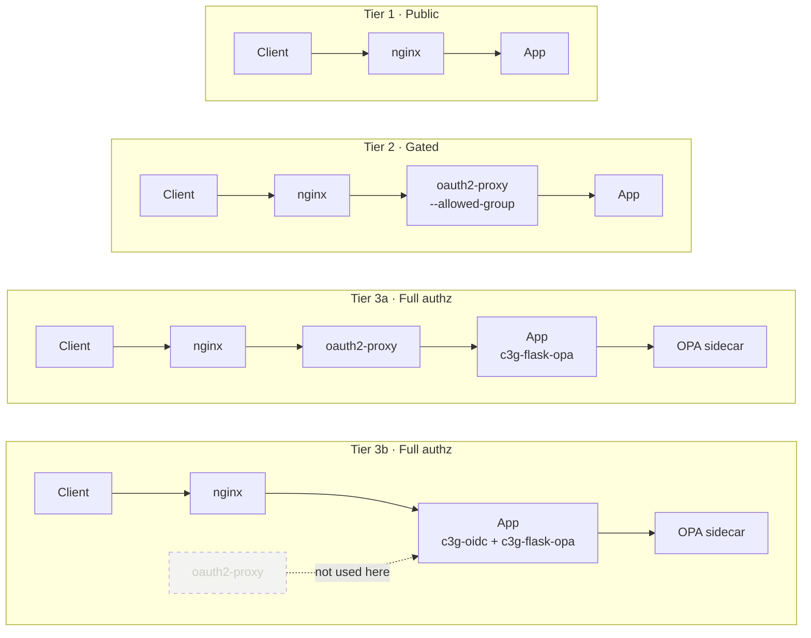

# \<web-app-template\>

First decide a clear name for your app that is descriptive enough!

Your app will run in a [podman container](https://podman.io/docs) — this makes its deployment
easier in our infrastructure. We use the `Containerfile` naming instead of `Dockerfile` to
follow [Open Container Initiative (OCI)](https://opencontainers.org/) conventions; if you
already know Dockerfiles, it's more or less the same thing.

This page covers the concepts and definitions shared by every app built from this template —
read it once first, then go to the file for your role:

- **[for-app-developers.md](./for-app-developers.md)** — everything to build into the app:
  install path, database, secrets, data storage, the GitHub Actions workflow that builds and
  publishes the container, and, if the app needs one, an authentication/authorization pattern.
- **[for-maintainers.md](./for-maintainers.md)** — everything to deploy and run the app on the
  shared webapp VM: podman/systemd, secrets, storage volumes, Postgres, nginx routing, and, if
  the app needs it, deploying oauth2-proxy/OPA.

## Infrastructure at a glance

Apps run as podman containers, as systemd user services under the `genome` user, on the shared
webapp VM (`172.16.8.75`) — all apps and their databases currently run on that one host. A
separate VM runs nginx as the shared edge: every app gets a subdomain under
`*.c3g-app.sd4h.ca`, reverse-proxied there. Postgres is the only supported database. COmanage is
the one identity source behind every app that needs a login.

Every app fits one of four patterns, from simplest to most involved — nginx and Postgres are
constant across all of them, and only the identity path changes. Each diagram below shows
exactly what that tier has, no more (the criteria for picking one are in
[Authentication & authorization](#authentication--authorization) below):

**Tier 1 · Public** — no identity check at all.

**Tier 2 · Gated** — a coarse yes/no check, no app code involved.

**Tier 3a · Full authz, browser-only clients** — oauth2-proxy stays, OPA added behind it.

**Tier 3b · Full authz, non-browser clients** — oauth2-proxy removed, the app validates tokens
itself.

## Authentication & authorization

How identity and access work across C3G web apps: the concepts, the current state, and the plan
going forward. This is the concepts page — for what to actually do, see the "Authentication &
authorization" section in
[for-app-developers.md](./for-app-developers.md#authentication--authorization) (deciding
whether your app needs it, and which pattern to use, by app type) or
[for-maintainers.md](./for-maintainers.md#authentication--authorization) (deploying
oauth2-proxy and/or OPA alongside an app, and the nginx config that goes with each pattern).
Both build on the concepts and definitions below.

### The big picture

Three tiers cover every app so far (Flask, R Shiny today or anything else), and only the
third one is genuinely per-app work.

| Tier | What's needed | Pattern |
|---|---|---|
| **1 · Public** | No identity check at all. | nginx → app, directly. No OIDC client anywhere in the path. |
| **2 · Gated** | Valid COmanage user **and** a member of the one group assigned to this app — not just "any authenticated user," or every COmanage account in the org could reach a "private" app. | oauth2-proxy alone, with `--allowed-group` set to the app's one group. Zero app code. Works identically for Flask, R Shiny, or anything else that speaks HTTP. |
| **3 · Full authz** | Per-route or per-action decisions across multiple groups — a single yes/no gate isn't enough. | Always **oauth2-proxy or an in-app OIDC client, plus OPA behind it** for the fine-grained part — never both auth layers at once. |

Tier 3 splits into two mutually exclusive options, chosen per app — not layered together.
Running oauth2-proxy in front of an app that *also* validates its own tokens means two systems
independently trusting the same issuer/audience/keys for one request: more to keep in sync, not
a safety margin.

- **3a — oauth2-proxy stays, add an OPA library behind it.** Right default whenever every
  client is a person in a browser.
- **3b — full in-app OIDC client, oauth2-proxy removed entirely.** Only when the app has real
  non-browser clients (a CLI, a script, service-to-service calls) that a cookie-based proxy
  gate doesn't serve well.

*(`Tier 3b`'s `oauth2-proxy` node is dashed and disconnected on purpose — it's drawn to show
where it would have sat, not because it's part of that flow.)*

Neither `c3g-flask-opa` nor `c3g-oidc` is language-agnostic — the *recipe* behind them is. Your
app's language and client shape decide the concrete path:

| App type | Authn (Tier 3) | Authz add-on | Notes |
|---|---|---|---|
| Flask | oauth2-proxy (3a), or in-app `c3g-oidc` (3b — only if there are non-browser clients) | `c3g-flask-opa` | `project_tracking` is the reference implementation, 3b |
| R Shiny | oauth2-proxy, always — no non-browser client story exists for Shiny | `c3g.shiny.authz` | most Shiny apps only need Tier 2; real Tier 3 is per-action, not per-route |
| Other / anything else | oauth2-proxy by default; in-app OIDC only if it has non-browser clients | same recipe, own implementation | no library exists yet for a third language |

See **[for-app-developers.md](./for-app-developers.md#authentication--authorization)** for the
decision guide and code-level detail per app type, and
**[for-maintainers.md](./for-maintainers.md#authentication--authorization)** for how each
pattern gets deployed.

### Definitions

**COmanage**
The org's identity and collaboration-registry platform. Owns group (COU) membership — the
source of truth for who is in which group. Its OIDCop plugin also lets it act as the OpenID
Connect Provider: the thing that actually authenticates a login and issues tokens.

**OIDC**
OpenID Connect — the login protocol used throughout. A client redirects a user to COmanage to
log in, and gets back a token proving who they are and which groups they're in.

**oauth2-proxy**
A reverse proxy that sits in front of an app and speaks OIDC to COmanage on the app's behalf:
handles the login redirect, and keeps a session cookie so the browser isn't sent through a
fresh login on every request. Works identically for any app regardless of language — the cost
is one more running process per app.

The app never sees that cookie. It's between the browser and oauth2-proxy only. What the app
actually receives, on every request oauth2-proxy lets through, is a plain HTTP header — e.g.
`X-Forwarded-Groups` — with the user's groups already extracted from the ID token. The app
reads a header, not a cookie.

**nginx**
The shared edge reverse proxy, on its own VM, in front of every app. Terminates TLS
(`*.c3g-app.sd4h.ca`) and routes each request to the right app on the webapp VM. Makes no
identity decisions itself.

**OPA**
[Open Policy Agent](https://www.openpolicyagent.org) — a policy engine run as a small sidecar
process next to an app. Given a request's details (whatever an app chooses to send it — method,
path, groups, an action name) it answers exactly one question: allow or deny. The rules
themselves live as versioned policy files (Rego), separate from application code — see
[c3g-opa-policies](https://github.com/c3g/c3g-opa-policies).

**podman / systemd**
How apps actually run: each app is a container (podman), managed as a systemd user service
under the `genome` user on the shared webapp VM. No orchestration platform — just a process the
OS supervises and restarts.

**Authn vs. authz**
Two different questions, handed off at exactly one seam. *Authentication* is "who is this
user" — COmanage's job, whether reached via oauth2-proxy or an app's own OIDC client.
*Authorization* is "what can they do" — either oauth2-proxy's coarse group gate, or OPA's
fine-grained per-action decision. Nothing upstream of the seam knows about routes or actions;
nothing downstream of it knows about logins or tokens.

In neither case does the app itself decide. At Tier 2, the decision already happened before
the app saw the request — oauth2-proxy's gate either let it through or returned 403 on its
own. At Tier 3, the app calls out to OPA and enforces whatever comes back, but the policy that
produced that answer lives in Rego, not in the app's code. The app's own logic is never the
place an access decision gets made — only where it gets asked for and acted on.

### Sources

- [c3g-opa-policies](https://github.com/c3g/c3g-opa-policies) — `project_tracking/authz.rego`,
  `project_tracking/data.json`, `CLAUDE.md`
- [project_tracking](https://github.com/c3g/project_tracking) — `project_tracking/__init__.py`
- [project_tracking_cli](https://github.com/c3g/project_tracking_cli) (`pt_cli`) —
  `pt_cli/connect.py`, `pt_cli/cli.py`
- [c3g-flask-opa](https://github.com/c3g/c3g-flask-opa) — the Flask `before_request` library
  described in [for-app-developers.md](./for-app-developers.md#flask) (`FlaskOPA`,
  `groups_header_from_request()`, `groups_header_from_g()`); its own test suite runs it
  against a real OPA server loaded with `project_tracking`'s actual policy
- [c3g-oidc](https://github.com/c3g/c3g-oidc) — the in-app OIDC client library described in
  [for-app-developers.md](./for-app-developers.md#flask) (`server/`, `client/`)
- [c3g.shiny.authz](https://github.com/c3g/c3g.shiny.authz) — the R package described in
  [for-app-developers.md](./for-app-developers.md#real-tier-3-for-shiny) (`c3g_groups()`,
  `c3g_require_authz()`)
- [web-app-template](https://github.com/c3g/web-app-template) — deployment basics this section
  extends
